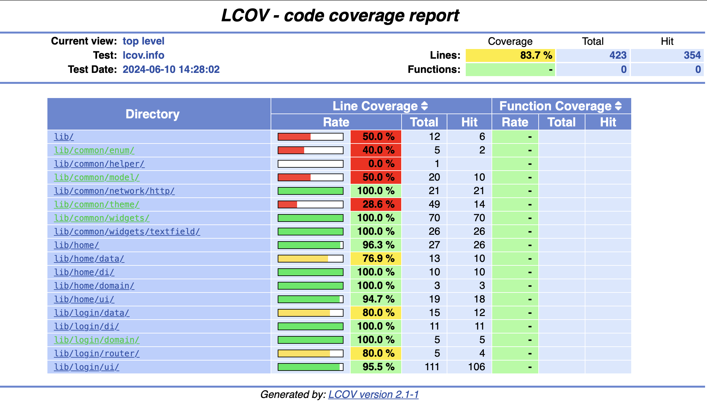

# bites_assignment

## Overview

Welcome to the BitesApp repository!

## Getting Started

To run the project locally, follow these steps:

1. Clone or download the project and open it in either Android Studio or Visual Studio Code.
2. Ensure that the Flutter SDK is installed and the path is linked with the environment. Refer to the [official Flutter documentation](https://docs.flutter.dev/get-started/install) for installation instructions.
3. Open a terminal and navigate to the project directory. Run the command `flutter run` to launch the application. Alternatively, if you're using Android Studio, simply click on the play button.

## Integration test by using Flutter test driver with covered 83% automation

To run the integration test locally, follow these steps:
1. Go to terminal run login test by flutter drive \
  --driver=test_driver/integration_test.dart \
  --target=integration_test/login_screen_test.dart
2. Run home test by flutter drive \
  --driver=test_driver/integration_test.dart \
  --target=integration_test/home_screen_test.dart

**Screenshot**:  


## Architecture

The project follows a modular architecture, divided into shared and feature modules:

- **Home**: home feature with data/domain/ui and di
- **Login**: login feature with data/domain/ui and di
- **Common**: Contains base models, network, utils, and widgets shared across the application.

Each layer of the architecture is designed to be testable, promoting code quality and maintainability.

## Layers

The trading module comprises three main layers:

1. **Data Layer**:
   - Includes the abstract interface `Repository`, responsible for fetching data from the WebSocket service.

2. **Domain Layer**:
   - Consists of the abstract `UseCase`, responsible for observing changes and mapping data models to domain models.

3. **Ui Layer**:
   - Features the `ViewModel`, which observes changes from the use case, generates UI states, and maps them to UI data.

## State Management

The application utilizes Riverpod for state management, offering several benefits:

- Automatic memory disposal with AutoDispose.
- Simple and elegant state observation.
- Built-in dependency injection capabilities.

By leveraging Riverpod, the codebase maintains a high level of flexibility and scalability. For instance, switching between different implementations of `ContactsRepository`, such as `MockContactsRepository` or `ContactsRepositoryImp`, is straightforward.

```dart
final contactsRepoProvider = Provider<ContactsRepository>(
    (ref) => ContactsRepositoryImpl(ref.watch(networkServiceProvider)));
```
## Additionals
- Implemented Bites styled bottom bar with code
- FlutterSecureStorage to save JWT tokens
- Design system for Bites theme
- Cairo font added

